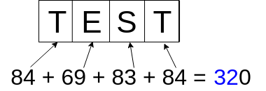

# caesar-cipher

The idea behind this project was to start getting in touch with python, so I had the idea to build a program that could encrypt and decrypt my .txt files using and old but effective algorithm called **Caesar Cipher**.

## Explanation

The algorithm consists of shifting a certain number of algorithms based on a key.  
Usually the key consists in choosing a static number, but in order to make it funnier I build my key using the file name that is inserted.

<p align="center">
  
</p>
In this example the key will be 32.

And in the picture bellow you can see how the shift works:

<p align="center">
  
</p>

## Getting Started

These instructions will get you a copy of the project up and running on your local machine for development and testing purposes.

### Prerequisites

In order to run this app its needed

- Python3: You can install it by following this great guide [Python3 installation guide](https://realpython.com/installing-python/)
- Git

### Installing

Clone repository:

```bash
$ git clone https://github.com/diogofalken/caeser-cipher.git
$ cd caeser-cipher/
```

Start program:

```bash
$ cd caeser-cipher/
$ python3 main.py
```

_Note 1: If you want to encrypt a file you need to have a file in the decrypt folder_  
_Note 2: If you want to decrypt a file you need to have a file in the encrypt folder_

## Built With

- [Python3](https://www.python.org/) - Main language
- [Caeser Cipher](https://en.wikipedia.org/wiki/Caesar_cipher) - Encryption algorithm

## License

This project is licensed under the MIT License - see the [LICENSE.md](LICENSE) file for details

MIT © [Diogo Costa](https://diogomarques.tk)
